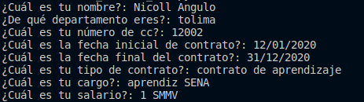
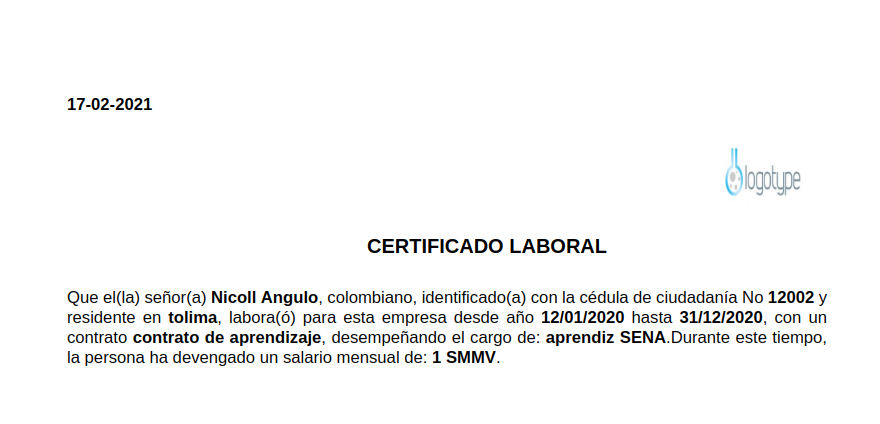

# Python-Poo-Algorithmost

This script creat certificate by the staff in a PDF file 

This is a information that you need to creat a certificate 

- name
- CC
- departament
- date initial job 
- date end  job
- type lease
- Position in the company
- salary

First, you need install reportlab, this library help us to make pdf with the certification.

You can use this command in the terminal 

`pip install reportlab`

Then, you can change the image in the route `img/logo.png`

Finaly, you need run `certificado_laboral_POO.py` and fill the inputs

Last, you have generate a certificate in pdf, show the files and you can see  a new file PDF

